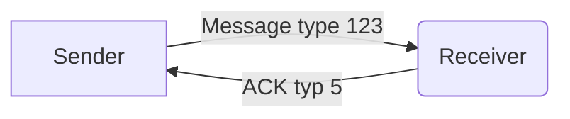
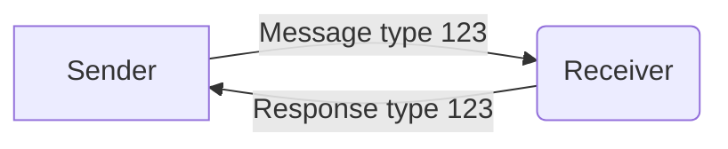
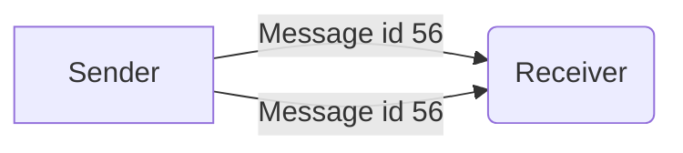

# 5: ACK

{{ messageData.description }}

## Lightbug comms

This applies to Lightbug devices, SDKs, apps and services.

 - ACKs will be sent when a message has an ID in the header field.
 - If an ID is not present, then no ACK will be sent because it is assumed the sender is not tracking successes/failures.
 - ACKs may always be sent for open and close messages (with type only) <!-- Currently the case for P1 comms-->

<HeaderSection :messageId="messageId" :yamlData="protocolData" />

<PayloadSection :messageId="messageId" :yamlData="protocolData" />

<ExamplesSection :messageId="messageId" :yamlData="protocolData" />

## Sequence

##### Simple ACK

The simple case is that a sender sends a message, and the receiver responds with an ACK message.

##### Response

The [Response Message ID](../protocol/headers#_3-response-message-id) field in the header can be used in place of an ACK if an immediate response is being sent, with a specific message type.

In such cases the response will not have an ACK message type, instead it will have the message type of the response (often the same as the request).

##### Retries

If a sender does not receive an ACK or response, it may resend the message.

<CodeSection :messageId="messageId" :yamlData="protocolData" />
