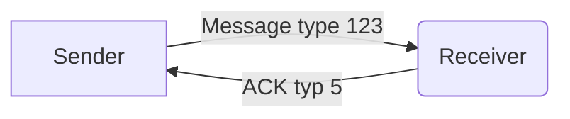
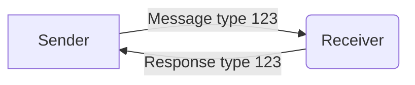
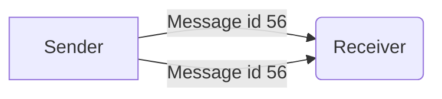

# 5: ACK

{{ messageData.description }}

## Header

<HeaderTable :messageId="messageId" headerText="" :yaml-data="protocolData"/>

<small>This is an extract of header fields that are relevant to this message type, you can find them all documented in the [Headers](../protocol/headers.md) section.
</small>

## Payload

<PayloadTable :messageId="messageId" headerText="" :yaml-data="protocolData"/>

## Examples

##### {{ example.name }}

<Message :byteString="example.bytes" :yaml-data="protocolData" :defaultCollapsed="false" :realDeviceInfo="example.real"/>

## Sequence

##### Simple ACK

The simple case is that a sender sends a message, and the receiver responds with an ACK message.

##### Response

The [Response Message ID](../protocol/headers#_3-response-message-id) field in the header can be used in place of an ACK if an immediate response is being sent, with a specific message type.

In such cases the response will not have an ACK message type, instead it will have the message type of the response (often the same as the request).

##### Retries

If a sender does not receive an ACK or response, it may resend the message.

## Code

For convenience, the following constants can be used to reference the payload fields.

<ProtocolMessageConstants :messageId="messageId" :yaml-data="protocolData"/>
