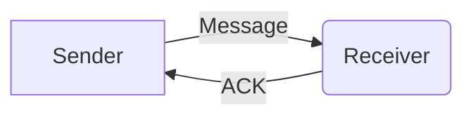
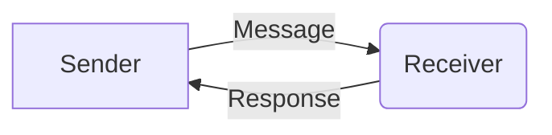
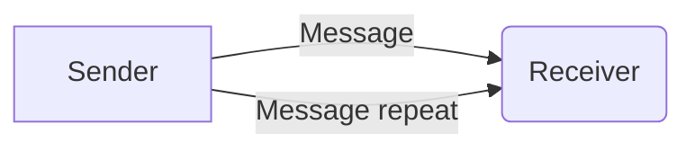

# 5: ACK

<SplitColumnView>
<template #left>

Used to acknowledge a previously sent message.

The [Response Message ID](../protocol/headers#_3-response-message-id) field in the header can be used in place of an ACK if an immediate response is being sent.

In such cases the response will not have an ACK message type, instead it will have the message type of the response (often the same as the request).

If a sender does not receive an ACK or response, it may resend the message.

ACKs should not themselves be ACKed.

</template>
<template #right>

<h3>Header</h3>

If the message being ACKed has a message ID, it should be included in the `Response to message ID` header field.

<HeaderTable :headerIds="[3]" headerMarginTop="0px" />

<h3>Payload</h3>

If a message is sent with no ID, then you may simply receive an ACK with the previous message type in the payload.

<PayloadTable :messageId="5" headerText="" headerMarginTop="0px" :yaml-data="protocolData" />

</template>
</SplitColumnView>

## Examples

### ID and Type known

ACK message, acknowledging a message with type `32` and ID `234`

<ProtocolBytes
    byteString="3 18 0 5 0 0 0 2 0 1 2 2 32 0 1 234 14 66"
    :boldPositions="[3,12,15]"
    :allowCollapse="true" defaultCollapsed="true"
    :yaml-data="protocolData"
/>

### Only type known

In the case that a message ID is not known, the field can be omitted.

<ProtocolBytes
    byteString="3 15 0 5 0 0 0 1 0 1 2 32 0 164 69"
    :boldPositions="[3,11]"
    :allowCollapse="true" defaultCollapsed="true"
    :yaml-data="protocolData"
/>

## Code

For convenience, the following constants can be used to reference the payload fields.

<GenerateConsts :messageId="5" :yaml-data="protocolData"/>
